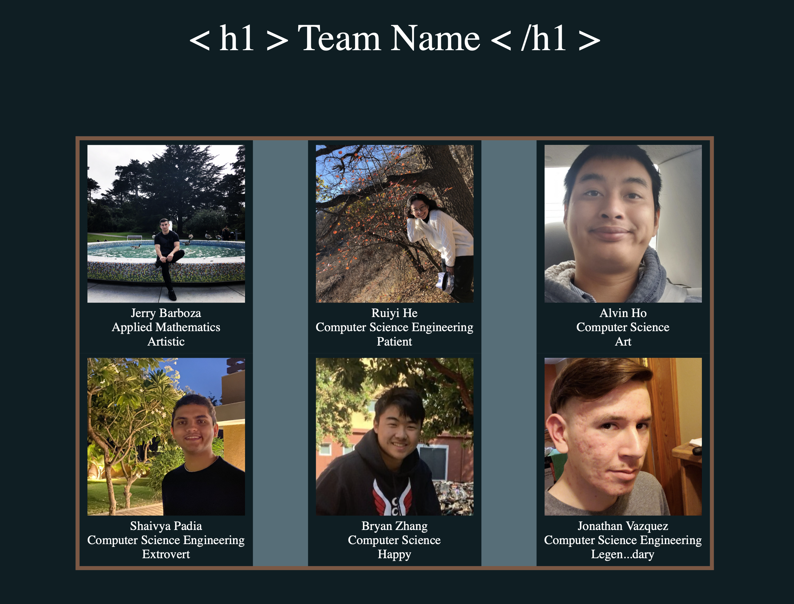

This was my first time programming with HTML and CSS. It was done Spring 2021 for my Web Programming class ECS-162 at University of California Davis. I was in a Team of 6 and we all had to make our own web programming project that gives a short desciption of our team. Once everyone was done with their own project, we had to vote for the one we thought it was best and submit that one. Mine ended up having the most votes so we ended up submitting this one. I also came out with our team name "/<h1> Team Name /</h1>" since I wanted to add some humor to it. 
  
[a link] (https://barbozajerry.com)

